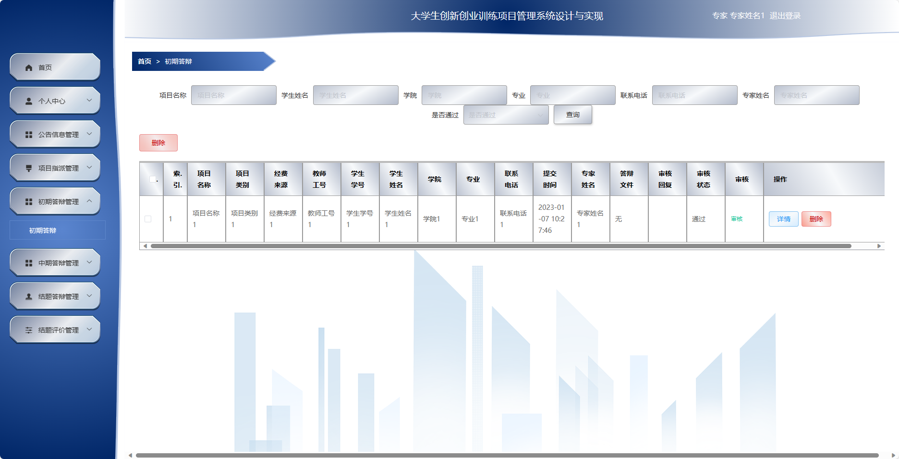
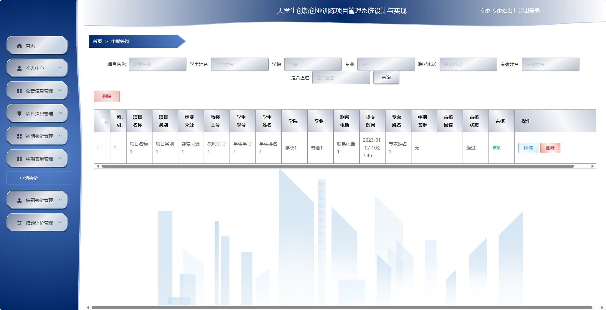
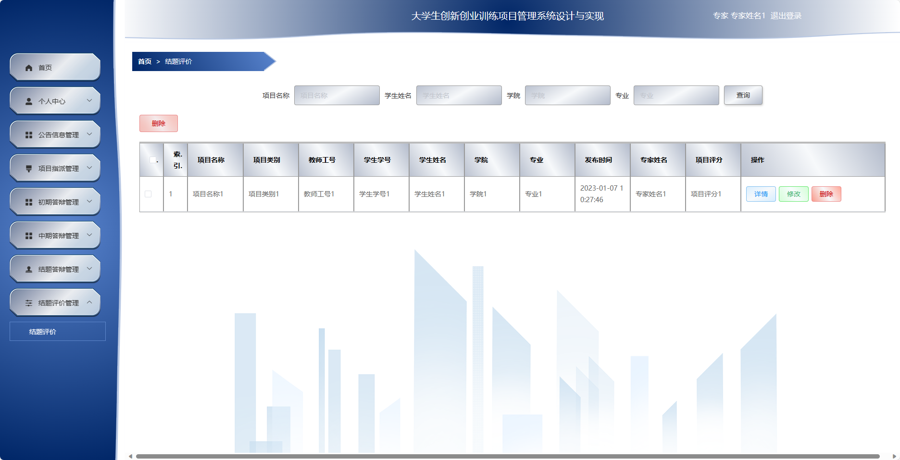
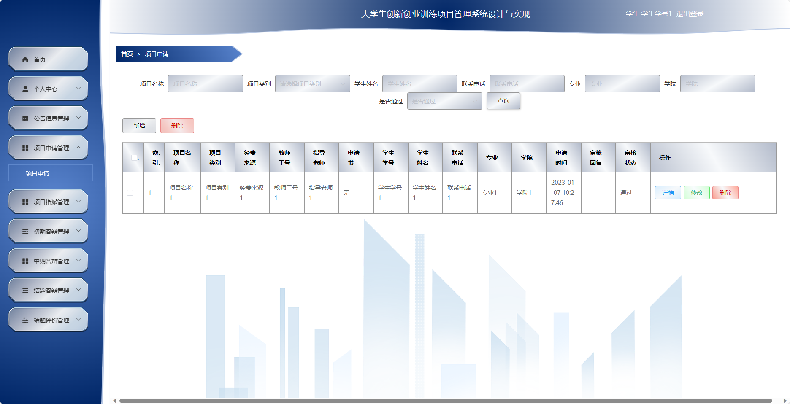
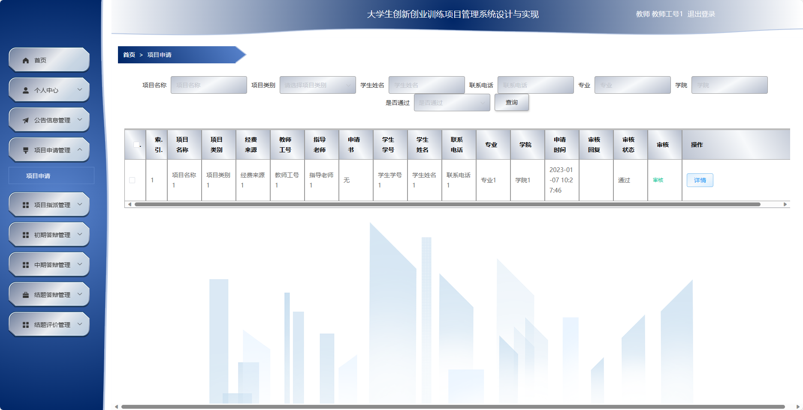
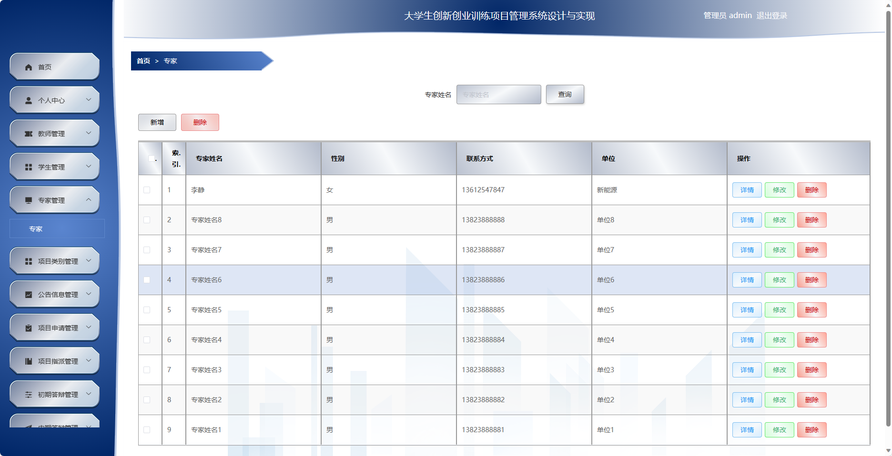
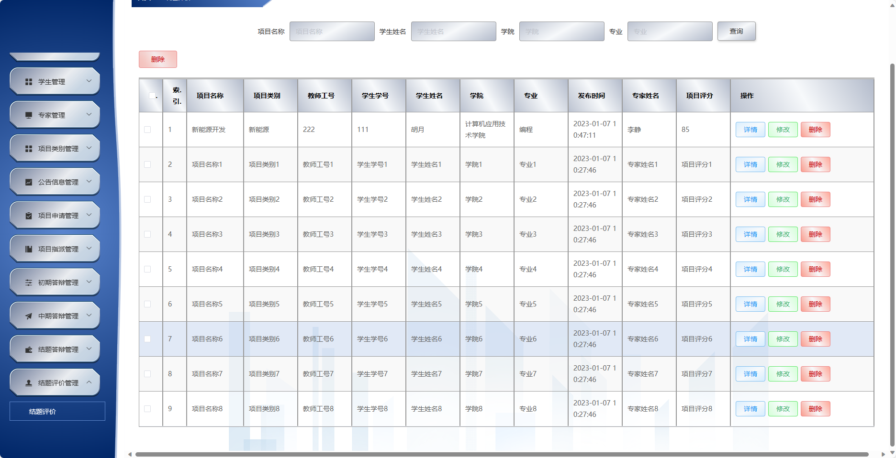
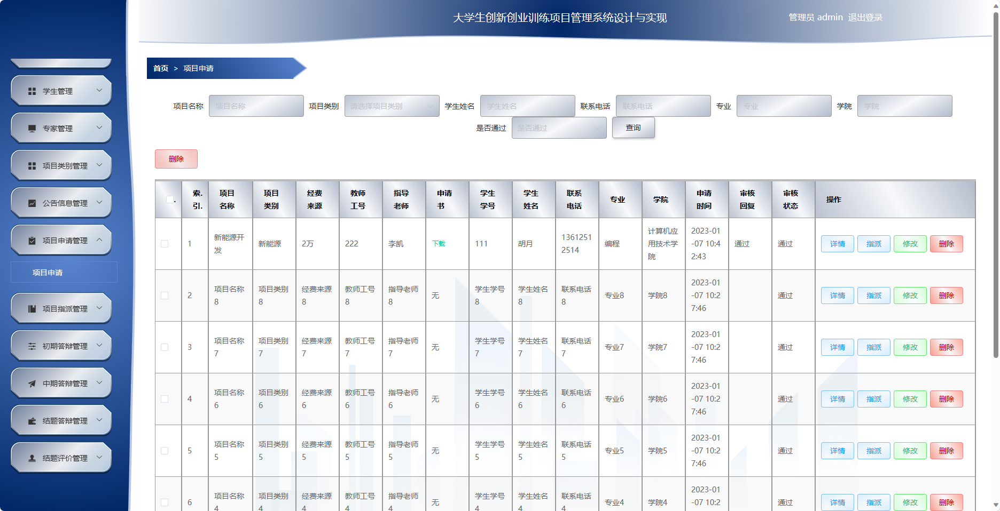
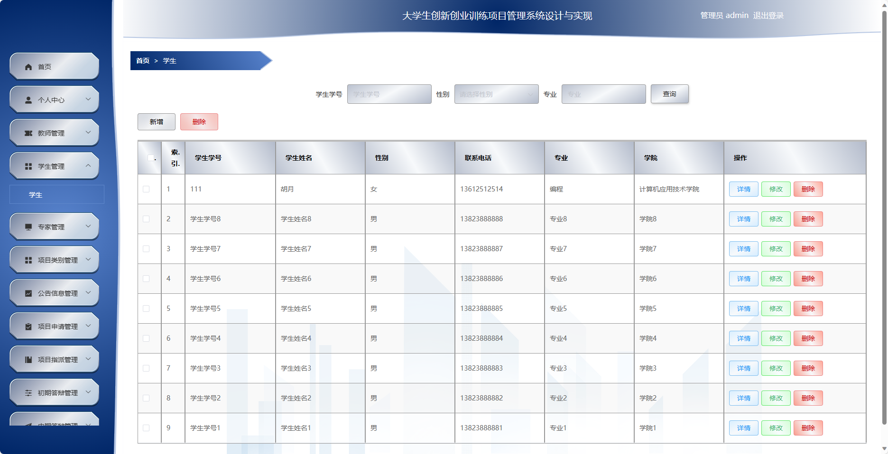

## 基于SpringBoot的大学生创新创业训练项目管理系统

###  获取sql数据库文件: 从戎源码网 (https://armycodes.com/) QQ: 386869957 QQ群: 377586148
###  所有系统地址: (https://github.com/YuLin-Coder/AllProjectCatalog) 
###  所有项目以及源代码本人均调试运行无问题 可支持远程安装部署调试、定制修改、代码讲解

## 项目介绍
基于SpringBoot的大学生创新创业训练项目管理系统，系统包含四种角色：管理员、教师、学生、用户,系统分为前台和后台两大模块，主要功能如下。

### 【管理员】:
- 个人中心：管理个人信息和账户。
- 教师管理：管理系统中的教师信息。
- 学生管理：管理系统中的学生信息。
- 专家管理：管理系统中的专家信息。
- 项目类别管理：管理系统中的项目类别信息。
- 公告信息管理：发布和管理系统中的公告信息。
- 项目申请管理：查看和管理所有的创新创业项目申请信息。
- 项目指派管理：对创新创业项目进行指派和调配。
- 初期答辩管理：查看和管理所有创新创业项目的初期答辩情况。
- 中期答辩管理：查看和管理所有创新创业项目的中期答辩情况。
- 结题答辩管理：查看和管理所有创新创业项目的结题答辩情况。
- 结题评价管理：对创新创业项目进行结题评价。
- 系统管理：修改个人密码和其他系统设置。

### 【教师】:
- 个人中心：管理个人信息和账户。
- 公告信息管理：查看系统发布的公告信息。
- 项目申请管理：提交创新创业项目的申请。
- 项目指派管理：管理被分配到的创新创业项目信息。
- 初期答辩管理：管理所指导的创新创业项目的初期答辩情况。
- 中期答辩管理：管理所指导的创新创业项目的中期答辩情况。
- 结题答辩管理：管理所指导的创新创业项目的结题答辩情况。
- 结题评价管理：对所指导的创新创业项目进行结题评价。
- 系统管理：修改个人密码和其他系统设置。

### 【学生】:
- 个人中心：管理个人信息和账户。
- 公告信息管理：查看系统发布的公告信息。
- 项目申请管理：提交创新创业项目的申请。
- 项目指派管理：管理被分配到的创新创业项目信息。
- 初期答辩管理：管理参与的创新创业项目的初期答辩情况。
- 中期答辩管理：管理参与的创新创业项目的中期答辩情况。
- 结题答辩管理：管理参与的创新创业项目的结题答辩情况。
- 结题评价管理：对参与的创新创业项目进行结题评价。
- 系统管理：修改个人密码和其他系统设置。

### 专家：
- 个人中心：管理个人信息和账户。
- 公告信息管理：查看系统发布的公告信息。
- 项目指派管理：被分配到的创新创业项目信息。
- 初期答辩管理：管理所评审的创新创业项目的初期答辩情况。
- 中期答辩管理：管理所评审的创新创业项目的中期答辩情况。
- 结题答辩管理：管理所评审的创新创业项目的结题答辩情况。
- 结题评价管理：对所评审的创新创业项目进行结题评价。
- 系统管理：修改个人密码和其他系统设置。

## 项目技术
- 编程语言：Java
- 数据库：MySQL
- 项目管理工具：Maven
- 前端技术：HTML、CSS、JavaScript、Jquery、Vue
- 后端技术：Spring、SpringMVC、MyBatis

## 运行环境
- JDK版本：JDK1.8及以上
- 开发工具：IDEA、Ecplise、Myecplise都可以
- 数据库: MySQL5.7及以上
- Maven：maven3.0及以上
- Node：14.14.0及以上

## 运行截图

